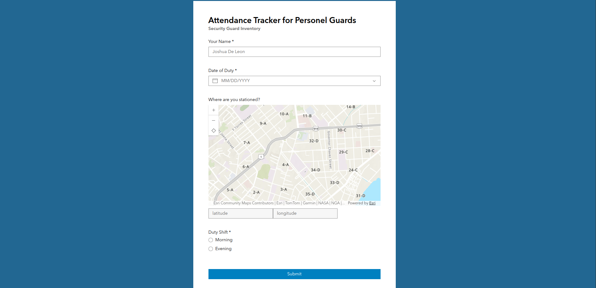

# ArcGIS Survey 123 Securiy Guard

This is for tracking security guards and its attendance using the concept of 123 survey,




## Techstack
1. ArcGIS SDK JS
2. Esri Calcite
3. HTML - CSS - JS

## Structure
```
index.html        -> logins
attendance.html   -> attendance form (123 Arc Survey)
list.html         -> list of guards
success.html      -> sucess page
```
